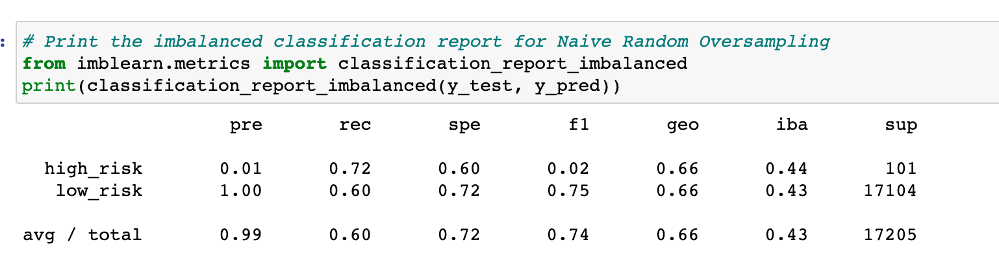
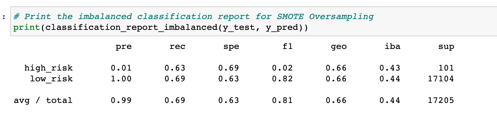
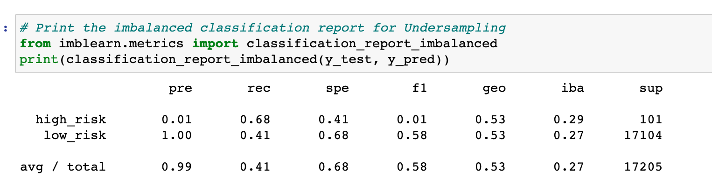
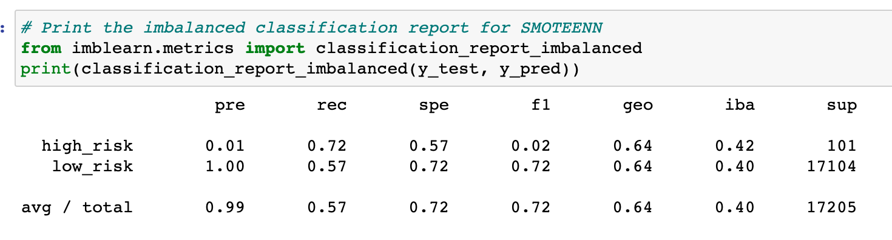
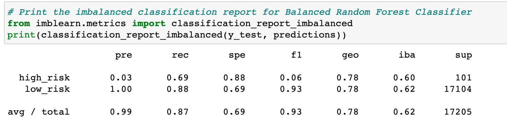
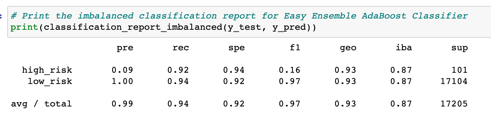

# Credit_Risk_Analysis

## Overview of the analysis: 
This analysis uses credit card data from LendingClub to predict credit risk. In total, 6 machine learning models are used to predict loan risk. 

## Results: 

### Randon Oversampling

* The balance accuracy score for the Oversampling model was .66. This is not very high or very low accuracy
* There is high precision for predicting people with low-risk of credit fraud. 
* Low precision (.01) for predicting people with high-risk of credit fraud. It is more essential to predict people with high-risk of credit fraud so this is not good. 
* Low-risk recall or sensitivity is .60 and high-risk sensitivty is .72
* Overall this model was not great at predicting high-risk people for credit/loan fraud

### SMOTE Oversampling 

* The balance accuracy score for the SMOTE model was .66. This was the same as Random Oversampling
* There is very low preciscion for high-risk people for credit/loan fraud. The preciscion was .01
* On the other hand, there is high precision for low-risk people for credit/loan fraud. This means the model is good at predicting people who would be low-risk to provide a loan to. The precision was 1.0 
* The sensitivity for high-risk people was .63, while it was .69 for low-risk people. This means our model was not low or high for predicting true positives between high and low-risk people for credit fraud. 

### Undersampling 

* The balance accurary score for the Undersampling Model was.55, performing worse than SMOTE or Random Oversampling
* Again, the precision for high-risk was extremely low, scoring .01. The preciscion for low-risk was extremely high scoring 1.0. 
* Recall for high-risk people was .68, for low-risk people it was .41. Similarly to Random Oversampling, this model was better at predicting true positives for high-risk people. However, neither recall scores were very high. 

### SMOTEENN 

* The balance accuracy score for the SMOTEENN model was .64. This model had lower accuracy then Random and SMOTE Oversampling. 
* The precision for high-risk people was .01, while for low-risk people it was 1.0. Meaning this model has only high preciscion for predicting low-risk people for loans. It provides a lot of false positives for riskier people to consider for a loan. 
* Recall for high-risk people was relatively high, at .72
* Recall for low-risk people was not high, at .57

### Balanced Random Forest

* The balance accuracy score for the model was .87. This could be misleading. 
* This model displayed very low precision for predicting high-risk people for a loan. 
* High precision (1.0) for low-risk people considered for a loan. 
* Score of .69 for recall for high-risk people. This model does alright when it comes to true positives when labeling a person as high-risk for a loan. 
* Low-risk people had a recall of .88, meaning they scored fairly high when predicing true positives. 

### Easy Ensemble AdaBoost

* This model had the highest balanced accuracy score, with a .93
* This model had the highest precision for high-risk people. However, it still scored poorly at precision for high-risk people, scoring a .09
* Like the other models, the precision for low-risk people was at, scoring 1.0 
* The recall for both high and low-risk people were high. Higher than any other model. High-risk people had a sensitivity of .92. Low-risk people had a sensitivity of .94

## Summary:

From our original dataset, we had far more low-risk people than high-risk. There were 68,470 low-risk people vs. 347 high-risk people to consider for a loan. Each of our models had very high preciscion for predicting low-risk people to consider for a loan. However, that is not the most useful for predicting riskier people to give credit to. High precision for low-risk people, with extremely low preciscion for high-risk people means that any of these models can potentially lead to a lot of false positives, meaning people labeled as low risk when in fact they are riskier to give a loan to. 

Truly only one model outperformed the rest and that was Easy Ensemble Adaboost. It had a balanced accuracy score and recall (for both low and high-risk people) over .90. However, like every other model it performed terribly when it came to the precision of high-risk people. It may be riskier to have more false positives in a model for our particular dataset, vs. more false negatives. In this case, using any model with low precision for high-risk people for loans can lead to more false positives, and money lost by giving out loans to the wrong people. I could not confidently reccomend any of these models to predict the risk of credit/loan fraud using this particular dataset to train & predict outcome. Maybe a dataset with more high-risk individuals included can be better to train & predict with. 
